#  R2.02 - Développement d'applications avec IHM

### IUT d'Aix-Marseille - Département Informatique Aix-en-Provence

* **Ressource:** [R2.02](https://cache.media.education.gouv.fr/file/SP4-MESRI-26-5-2022/14/6/spe617_annexe15_1426146.pdf)

* **Responsables:**

  * [Sébastien Nedjar](mailto:sebastien.nedjar@univ-amu.fr)

* **Enseignants :**

  * [Frédéric Flouvat](mailto:frederic.flouvat@univ-amu.fr)
  * [Sophie Nabitz](mailto:sophie.nabitz@univ-avignon.fr)
  * [Samir Chtioui](mailto:samir.chtioui@gmail.com)

* **Besoin d'aide ?**
    * Consulter et/ou créer des [issues](https://github.com/IUTInfoAix-R202/tp2/issues)
    * [Email](mailto:sebastien.nedjar@univ-amu.fr) pour toute question

---

## TP2 - Propriétés et bindings

> 🎓 **Accepter le devoir TP2 sur GitHub Classroom** : 👉 **https://classroom.github.com/a/o8W7l2oc**
>
> Cela crée votre dépôt personnel `IUTInfoAix-R202-2026/tp2-votreLogin`. La marche à suivre (Classroom puis Codespace) est commune à tous les TP : voir le [TP1](https://github.com/IUTInfoAix-R202/tp1#mise-en-place).

> Cours associé : [CM2 - Propriétés, bindings et contrôles](https://iutinfoaix-r202.github.io/cours/cm2-donnees-et-liaison.html)

---

## Objectifs de la séance

### Ce que vous saurez faire à la fin de cette séance

Les exercices de ce TP sont organisés en progression. Cette progression suit la **taxonomie de Bloom**, un modèle pédagogique qui décrit les niveaux de maîtrise d'un savoir-faire - du plus simple (comprendre un concept) au plus complexe (créer une application complète).

| Niveau Bloom | Exercices | Vous serez capable de... | Compétence BUT |
|---|---|---|---|
| **Comprendre** | 1-2 | Décrire le fonctionnement des propriétés JavaFX (`IntegerProperty`, `StringProperty`...), distinguer `InvalidationListener` et `ChangeListener`, expliquer les effets de `bind()` et `unbind()` | AC11.02, AC12.02 |
| **Appliquer** | 3-5 | Intégrer des propriétés dans une interface graphique, construire des bindings calculés (aire d'un triangle, affichage dynamique), relier des données à une interface sans `setText()` | AC11.04, AC12.02 |
| **Analyser / Créer** | 6-8 | Concevoir un binding de bas niveau avec `computeValue()`, synchroniser plusieurs contrôles par `bindBidirectional()`, assembler une application complète avec conversion de grandeurs physiques | AC11.04 |

**Tout au long du TP**, vous pratiquez aussi le **workflow professionnel** (GitHub Classroom, Codespace, Maven, branche -> Pull Request -> review). Ces compétences sont formellement développées et évaluées en **R2.03 (Qualité de développement)**, module couplé à R2.02 par la SAÉ 2.01 commune.

---

### Pourquoi cette démarche ?

Ce TP utilise le **TDD (Test-Driven Development) en baby steps** : les tests sont livrés désactivés (`@Disabled`) et vous les activez un par un, comme un cahier des charges dont on implémente les exigences une à une. Ce n'est pas un artifice pédagogique - c'est une **méthode de développement professionnel** (formalisée par Kent Beck dans l'Extreme Programming) utilisée dans l'industrie logicielle.

Le workflow Git que vous pratiquerez - créer une branche par exercice, pousser, ouvrir une Pull Request, recevoir une review automatique de Copilot, puis merger - reproduit le **cycle de travail en entreprise**. L'objectif est d'apprendre à collaborer avec des outils, pas seulement à écrire du code.

Copilot Chat est configuré dans ce projet comme un **tuteur** : il ne donnera pas la solution d'emblée. Il commence par expliquer le concept, puis oriente vers la documentation, et ne propose du code qu'en dernier recours. L'objectif est que vous compreniez chaque ligne de code que vous écrivez.

---

### Lien avec la SAE 2.01

Dans la SAE 2.01, vous construirez une interface de visualisation et de manipulation de données issues de capteurs de détection et d'identification de chauve-souris. Ces capteurs émettent en continu des mesures (fréquence ultrasonique, amplitude, durée du cri...) que l'interface doit refléter en temps réel.

C'est exactement ce que couvrent les **propriétés et les bindings** de ce TP : au lieu d'interroger un capteur manuellement (approche impérative) puis de mettre à jour l'affichage à la main, vous déclarez une *liaison* entre la source de données et les composants visuels. Dès que la valeur change côté capteur, l'affichage se met à jour automatiquement.

La progression du module prépare directement à cet objectif :
- **TP1** - vous avez construit des interfaces statiques et réagi à des événements utilisateur
- **TP2** (ce TP) - vous apprenez à lier des données à des composants visuels : c'est le mécanisme qui permet à l'interface de "suivre" l'évolution des données capteurs
- **TP3** - vous structurerez l'interface avec FXML pour séparer le code de la mise en page
- **TP4** - vous appliquerez le patron MVVM pour organiser proprement les couches modèle / vue
- **TP5** - vous persisterez les données de mesures dans une base de données

---

> [!NOTE]
> **Mise en place, évaluation, commandes, workflow Git, assistance IA et dépannage : identiques au TP1.** Pour ne pas dupliquer ce qui a déjà été présenté, reportez-vous au README du TP1 :
> [Mise en place (Classroom + Codespace)](https://github.com/IUTInfoAix-R202/tp1#mise-en-place) · [Comment vous êtes évalué·e](https://github.com/IUTInfoAix-R202/tp1#rendu-du-travail-et-évaluation) · [Commandes Maven essentielles](https://github.com/IUTInfoAix-R202/tp1#commandes-essentielles) · [Workflow Git par exercice](https://github.com/IUTInfoAix-R202/tp1#workflow-de-développement---un-cycle-par-exercice) · [Assistance IA (Copilot Chat)](https://github.com/IUTInfoAix-R202/tp1#assistance-ia) · [Dépannage](https://github.com/IUTInfoAix-R202/tp1#dépannage)

Le TP2 comporte **8 exercices principaux + 2 bonus**, à faire dans l'ordre. Chaque exercice vit dans son propre sous-paquet (code et tests en miroir) et embarque ses propres commandes git dans sa section « Travail à faire » : vous créez une branche, activez les tests un par un, implémentez le minimum, puis poussez.

---

## Exercice 1 - PropriétéSimple (★)

### Objectif

Cet exercice est entièrement en **console** (pas d'interface graphique). Son objectif est de vous faire manipuler directement les classes de propriétés JavaFX et de comprendre la différence fondamentale entre `InvalidationListener` et `ChangeListener`. Ce sont les deux mécanismes d'observation de bas niveau sur lesquels repose tout le système de bindings.

> Avant de commencer, relisez les slides [CM2 #25-28](https://iutinfoaix-r202.github.io/cours/cm2-donnees-et-liaison.html#25) (convention JavaBeans → propriétés observables), [#30-31](https://iutinfoaix-r202.github.io/cours/cm2-donnees-et-liaison.html#30) (les types de propriétés), et [#32-35](https://iutinfoaix-r202.github.io/cours/cm2-donnees-et-liaison.html#32) (Invalidation vs Change listeners).

### Ce que vous allez découvrir

- [`IntegerProperty`](https://openjfx.io/javadoc/25/javafx.base/javafx/beans/property/IntegerProperty.html) et [`SimpleIntegerProperty`](https://openjfx.io/javadoc/25/javafx.base/javafx/beans/property/SimpleIntegerProperty.html) : une propriété entière observable
- [`InvalidationListener`](https://openjfx.io/javadoc/25/javafx.base/javafx/beans/InvalidationListener.html) : notifié une seule fois quand la valeur *devient potentiellement invalide* (comportement paresseux)
- [`ChangeListener`](https://openjfx.io/javadoc/25/javafx.base/javafx/beans/value/ChangeListener.html) : notifié à chaque changement de valeur, avec l'ancienne et la nouvelle valeur
- [`Observable.addListener()`](https://openjfx.io/javadoc/25/javafx.base/javafx/beans/Observable.html) et `removeListener()` pour abonner et désabonner des observateurs

### Qu'est-ce qu'une propriété JavaFX ?

Une propriété JavaFX est une **boîte observable** : elle contient une valeur et prévient automatiquement tous les observateurs abonnés quand cette valeur change. C'est un mécanisme général de liaison de données, utile bien au-delà des interfaces graphiques.


**Insight clé :** un `InvalidationListener` est *paresseux* - il se déclenche une seule fois quand la propriété devient invalide, et ne se redéclenche qu'après que la valeur ait été relue (via `get()`, ce qui la "revalide"). Un `ChangeListener` est *eager* - il se déclenche à **chaque** modification et reçoit l'ancienne et la nouvelle valeur.

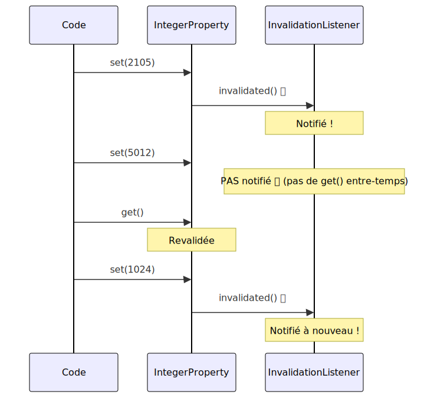

### Découverte du code

1. Ouvrez `src/main/java/fr/univ_amu/iut/exercice1/ProprieteSimple.java`. Vous y trouverez :
   - Un champ `IntegerProperty anIntProperty` déjà déclaré, ainsi que `invalidationListener` et `changeListener` pour stocker les observateurs
   - La méthode `creerPropriete()` **entièrement fournie** (instanciation + trois affichages)
   - Les méthodes `ajouterEtRetirerInvalidationListener()` et `ajouterEtRetirerChangeListener()` avec le scénario `setValue/set` déjà fourni et **deux TODO ciblés chacune** : afficher le header `Add ... listener.` + créer + abonner le listener, puis afficher le header `Remove ... listener.` + retirer le listener
   - Les accesseurs JavaBeans `getAnInt()`, `setAnInt()`, `anIntProperty()` déjà implémentés
   - Une méthode `main()` prête qui appelle les trois méthodes dans l'ordre

2. Ouvrez `src/test/java/fr/univ_amu/iut/exercice1/ProprieteSimpleTest.java`. Lisez les assertions - elles décrivent exactement la sortie console attendue. Les tests utilisent Mockito pour vérifier ce qui est affiché sur `System.out`.

### Ce que chaque test valide

| # | Test | Ce qu'il vérifie | Méthode testée |
|---|---|---|---|
| 1 | `testLaProprieteExisteApresSetAnInt` | `anIntProperty()` retourne non null | `setAnInt()` |
| 2 | `testLaValeurInitialeEst1024` | `getAnInt()` retourne 1024 | `setAnInt()` |
| 3 | `testCreerProprieteAfficheLeToString` | Affiche `IntegerProperty [value: 1024]` | `creerPropriete()` |
| 4 | `testCreerProprieteAfficheGet` | Affiche `anIntProperty.get() = 1024` | `creerPropriete()` |
| 5 | `testCreerProprieteAfficheGetValue` | Affiche `anIntProperty.getValue() = 1024` | `creerPropriete()` |
| 6 | `testInvalidationListenerEstDeclenche` | Le message d'invalidation apparaît | `ajouterEtRetirer...()` |
| 7 | `testInvalidationListenerPasDeclencheSiMemeValeur` | `setValue(1024)` ne déclenche rien (même valeur) | `ajouterEtRetirer...()` |
| 8 | `testInvalidationListenerEstParesseux` | `setValue(5012)` ne redéclenche pas (paresseux) | `ajouterEtRetirer...()` |
| 9 | `testInvalidationListenerRetireFonctionne` | Après `removeListener()`, plus de notifications | `ajouterEtRetirer...()` |
| 10 | `testChangeListenerEstDeclenche...` | Reçoit `oldValue = 1024, newValue = 2105` | `ajouterEtRetirer...()` |
| 11 | `testChangeListenerDeclencheAChaque...` | Se déclenche 2 fois (eager, contrairement à l'invalidation) | `ajouterEtRetirer...()` |
| 12 | `testChangeListenerRetireFonctionne` | Après `removeListener()`, plus de notifications | `ajouterEtRetirer...()` |

### Sortie console attendue

Quand les trois méthodes sont implémentées correctement et exécutées via `main()`, la sortie doit être :

```
anIntProperty = IntegerProperty [value: 1024]
anIntProperty.get() = 1024
anIntProperty.getValue() = 1024

Add invalidation listener.
setValue() with 1024.
set() with 2105.
The observable has been invalidated.
setValue() with 5012.
Remove invalidation listener.
set() with 1024.

Add change listener.
setValue() with 1024.
set() with 2105.
The observableValue has changed: oldValue = 1024, newValue = 2105
setValue() with 5012.
The observableValue has changed: oldValue = 2105, newValue = 5012
Remove change listener.
set() with 1024.
```

Remarquez les différences :
- **Invalidation** : `set(2105)` déclenche le listener, mais `setValue(5012)` ne le redéclenche PAS (paresseux)
- **Change** : les deux changements (`set(2105)` et `setValue(5012)`) déclenchent le listener (eager)
- Dans les deux cas : `setValue(1024)` ne déclenche rien (la valeur ne change pas), et après `removeListener()` plus rien n'est notifié

### Travail à faire

Pour vous concentrer sur le mécanisme d'observation, **les affichages et le scénario sont entièrement fournis** dans `ProprieteSimple.java`. La méthode `creerPropriete()` est complète, et dans les deux méthodes de listener, seuls les `addListener()` et `removeListener()` sont à écrire (4 ajouts au total).

1. **Créez une branche** : `git checkout -b exercice1`
2. **Activez les tests 1-5** : ils passent immédiatement, sans rien implémenter (les accesseurs et `creerPropriete()` sont fournis). Vérifiez avec `./mvnw test`.
3. **Lancez `ProprieteSimple.main()` une première fois** (clic droit sur la méthode `main()` -> *Run Java* dans VSCode, ou bouton *Run* de votre IDE). Observez la sortie console : vous voyez les informations de la propriété (les trois lignes affichées par `creerPropriete()`) puis le scénario brut (`setValue() with 1024.`, `set() with 2105.`, ...) sans aucun message d'observation. Aucune ligne `Add ... listener.`, `Remove ... listener.`, ni de notification de changement n'apparaît : les listeners ne sont pas encore abonnés.
4. **Activez les tests 6-9** et complétez `ajouterEtRetirerInvalidationListener()` (deux blocs à compléter) :
   - Au premier TODO, écrivez 3 lignes :
     1. Affichez `"Add invalidation listener."` avec `System.out.println(...)`.
     2. Créez l'`InvalidationListener` avec une lambda `observable -> System.out.println("The observable has been invalidated.")` et stockez-le dans `this.invalidationListener`.
     3. Abonnez-le via `anIntProperty.addListener(invalidationListener)`.
   - Au second TODO, écrivez 2 lignes :
     1. Affichez `"Remove invalidation listener."`.
     2. Retirez le listener via `anIntProperty.removeListener(invalidationListener)`.
5. **Activez les tests 10-12** et complétez `ajouterEtRetirerChangeListener()` (deux blocs à compléter) :
   - Au premier TODO, écrivez 3 lignes :
     1. Affichez `"Add change listener."`.
     2. Créez le `ChangeListener<Number>` avec une lambda à 3 paramètres `(observable, oldValue, newValue) -> System.out.println("The observableValue has changed: oldValue = " + oldValue + ", newValue = " + newValue)` et stockez-le dans `this.changeListener`.
     3. Abonnez-le via `anIntProperty.addListener(changeListener)`.
   - Au second TODO, écrivez 2 lignes :
     1. Affichez `"Remove change listener."`.
     2. Retirez le listener via `anIntProperty.removeListener(changeListener)`.
6. **Relancez `ProprieteSimple.main()`** et comparez avec le premier run. De nouvelles lignes apparaissent à chaque endroit où votre code abonne, désabonne, ou voit la propriété changer :
   - `Add invalidation listener.` / `Remove invalidation listener.` (vos `addListener`/`removeListener` s'exécutent)
   - `The observable has been invalidated.` (une seule fois, à cause du comportement paresseux)
   - `Add change listener.` / `Remove change listener.`
   - `The observableValue has changed: oldValue = 1024, newValue = 2105`
   - `The observableValue has changed: oldValue = 2105, newValue = 5012`
   
   Cette différence est exactement ce que les listeners apportent : la possibilité d'**être notifié** quand une propriété change.
7. **Vérifiez** que les 12 tests passent : `./mvnw test`
8. **Finalisez** :

```bash
git add src/main/java/fr/univ_amu/iut/exercice1/
git add src/test/java/fr/univ_amu/iut/exercice1/
git commit -m "feat: exercice 1 - propriétés et listeners"
git push -u origin exercice1
```

> [!TIP]
> Si vous bloquez sur la différence entre `InvalidationListener` et `ChangeListener`, demandez à Copilot Chat : `Quelle est la différence entre InvalidationListener et ChangeListener en JavaFX ?`

---

## Exercice 2 - LiaisonPropriétés (★)

### Objectif

Toujours en **console**, cet exercice introduit le mécanisme de *binding* unidirectionnel : lier une propriété à une autre pour qu'elle la suive automatiquement. C'est la brique de base de la réactivité dans JavaFX.

> Avant de commencer, relisez les slides [CM2 #41](https://iutinfoaix-r202.github.io/cours/cm2-donnees-et-liaison.html#41) (la liaison unidirectionnelle avec `bind()`) et [#42](https://iutinfoaix-r202.github.io/cours/cm2-donnees-et-liaison.html#42) (propriété liée = non modifiable, `unbind()`, `isBound()`).

### Ce que vous allez découvrir

- [`Property.bind(ObservableValue)`](https://openjfx.io/javadoc/25/javafx.base/javafx/beans/property/Property.html#bind(javafx.beans.value.ObservableValue)) : lie une propriété à une source - elle prend automatiquement la valeur de la source
- [`Property.unbind()`](https://openjfx.io/javadoc/25/javafx.base/javafx/beans/property/Property.html#unbind()) : rompt la liaison, la cible garde sa dernière valeur
- [`Property.isBound()`](https://openjfx.io/javadoc/25/javafx.base/javafx/beans/property/Property.html#isBound()) : indique si la propriété est actuellement liée
- [`SimpleIntegerProperty`](https://openjfx.io/javadoc/25/javafx.base/javafx/beans/property/SimpleIntegerProperty.html) : implémentation concrète d'une propriété entière

### Le binding unidirectionnel - concept

Le binding unidirectionnel crée une dépendance à sens unique : `cible` suit `source`, mais l'inverse n'est pas vrai. Dès que `source` change de valeur, `cible` se met à jour automatiquement. Si l'on tente de modifier `cible` directement via `set()` alors qu'elle est liée, JavaFX lève une `RuntimeException` - c'est une protection : la cible est sous le contrôle exclusif de sa source.


### Découverte du code

1. Ouvrez `src/main/java/fr/univ_amu/iut/exercice2/LiaisonProprietes.java`. Vous y trouverez :
   - Un champ `anIntProperty` déjà présent (hérité de l'exercice 1)
   - Une méthode `lierEtDelierProprietes()` avec **le scénario `setValue/set` déjà fourni** et **deux TODO ciblés** : afficher le header `Binding ...` + appeler `bind()`, puis afficher le header `Unbinding ...` + appeler `unbind()`
   - Les accesseurs JavaBeans `getAnInt()`, `setAnInt()`, `anIntProperty()` déjà implémentés
   - Une méthode `main()` prête qui appelle `lierEtDelierProprietes()`

2. Ouvrez `src/test/java/fr/univ_amu/iut/exercice2/LiaisonProprietesTest.java`. Observez les deux catégories de tests :
   - Les tests 1-4 sont des **tests unitaires purs** : ils créent eux-mêmes des propriétés locales et vérifient le comportement de `bind()`, `unbind()` et `isBound()`. Ces tests ne dépendent pas de votre implémentation de `lierEtDelierProprietes()`.
   - Les tests 5-8 vérifient la **sortie console** de `lierEtDelierProprietes()` via un mock de `System.out`. Le test 5 (vérification de `otherProperty.get() = 0`) passe immédiatement car la ligne correspondante est fournie ; les tests 6-8 nécessitent vos `bind()` et `unbind()`.

### Sortie console attendue de `lierEtDelierProprietes()`

Quand `anIntProperty` vaut 1024 (initialisée par `setUp()` dans les tests), la méthode doit produire :

```
otherProperty.get() = 0
Binding otherProperty to anIntProperty.
otherProperty.get() = 1024
Calling anIntProperty.set(7168).
otherProperty.get() = 7168
otherProperty.get() = 7168
otherProperty.get() = 7168
Unbinding otherProperty from anIntProperty.
otherProperty.get() = 7168
Calling anIntProperty.set(8192).
otherProperty.get() = 7168
```

Remarquez que la dernière ligne affiche encore 7168, pas 8192 : après `unbind()`, la cible a conservé sa dernière valeur et ne suit plus les modifications de la source.

### Ce que chaque test valide

| # | Nom du test | Ce qu'il vérifie | Méthode / concept |
|---|---|---|---|
| 1 | `testBindPropageLaValeur` | Après `bind(source)`, `cible.get() == source.get()` | `bind()` - propagation immédiate |
| 2 | `testLaCibleSuitLaSource` | Quand `source.set(100)`, `cible.get() == 100` | `bind()` - propagation continue |
| 3 | `testUnbindArreteLaPropagation` | Après `unbind()` + `source.set(999)`, `cible` reste à 100 | `unbind()` - arrêt de propagation |
| 4 | `testIsBoundRetourneTrueSiLiee` | `isBound()` = false, true, false selon l'état | `isBound()` |
| 5 | `testAfficheValeurInitialeAvantLiaison` | Affiche `otherProperty.get() = 0` | Valeur par défaut avant `bind()` |
| 6 | `testLiaisonPropageLaValeurSource` | Affiche `Binding...` puis `otherProperty.get() = 1024` | Propagation lors du `bind()` |
| 7 | `testChangementSourcePropageVersCible` | Affiche `otherProperty.get() = 7168` au moins 3 fois | Propagation lors de `set()` |
| 8 | `testApresUnbindLaCibleNeSuitPlus` | Affiche `Unbinding...` puis `Calling...set(8192)` | `unbind()` - indépendance retrouvée |

### Travail à faire

Pour vous concentrer sur le mécanisme de liaison, **le scénario d'affichage et les modifications de la source sont entièrement fournis** dans `LiaisonProprietes.java`. Seuls les deux appels `bind()` et `unbind()` (avec leurs headers respectifs) sont à écrire (4 lignes au total).

1. **Créez une branche** : `git checkout -b exercice2`
2. **Activez les tests 1-5** : ils passent immédiatement, sans rien implémenter (les tests 1-4 sont des tests unitaires purs sur `bind`/`unbind`/`isBound`, le test 5 vérifie une ligne déjà fournie). Vérifiez avec `./mvnw test`.
3. **Lancez `LiaisonProprietes.main()` une première fois** (clic droit sur la méthode `main()` -> *Run Java* dans VSCode, ou bouton *Run* de votre IDE). Observez la sortie console : `otherProperty.get() = 0` apparaît partout, même après `Calling anIntProperty.set(7168).` puis `Calling anIntProperty.set(8192).`. Normal : sans `bind()`, `otherProperty` est totalement indépendante de `anIntProperty`. Aucun header `Binding ...` ni `Unbinding ...` non plus.
4. **Activez les tests 6-8** et complétez `lierEtDelierProprietes()` (deux blocs à compléter) :
   - Au premier TODO, écrivez 2 lignes :
     1. Affichez `"Binding otherProperty to anIntProperty."` avec `System.out.println(...)`.
     2. Liez via `otherProperty.bind(anIntProperty)`.
   - Au second TODO, écrivez 2 lignes :
     1. Affichez `"Unbinding otherProperty from anIntProperty."`.
     2. Déliez via `otherProperty.unbind()`.
5. **Relancez `LiaisonProprietes.main()`** et comparez avec le premier run. Vous devriez voir :
   - Les deux headers `Binding ...` et `Unbinding ...` apparaître.
   - `otherProperty.get() = 1024` juste après le bind (la valeur de la source a été propagée).
   - `otherProperty.get() = 7168` (×3) après `set(7168)` (la propagation est continue).
   - **Mais après `unbind()` puis `set(8192)`** : `otherProperty.get() = 7168` reste 7168, pas 8192. La cible a conservé sa dernière valeur et ne suit plus la source.
   
   Cette différence est exactement ce que `bind()` apporte : la cible **suit** la source tant que la liaison existe, et **fige sa dernière valeur** quand on délie.
6. **Vérifiez** que les 8 tests passent : `./mvnw test`
7. **Finalisez** :

```bash
git add src/main/java/fr/univ_amu/iut/exercice2/
git add src/test/java/fr/univ_amu/iut/exercice2/
git commit -m "feat: exercice 2 - bind/unbind unidirectionnel"
git push -u origin exercice2
```

> [!TIP]
> Si vous hésitez sur la différence entre `bind()` et `setValue()`, demandez à Copilot Chat : `Que se passe-t-il si j'appelle set() sur une propriété JavaFX qui est liée par bind() ?`

---

## Exercice 3 - PaletteRéactive (★★)

### Objectif

Cet exercice reprend la **Palette de l'exercice 6 du TP1** et la refactorise avec des propriétés et des bindings. Là où le TP1 utilisait `setText()` dans un écouteur d'événement, vous allez déclarer une *liaison* entre la propriété `nbClics` et le texte du label - le texte se met alors à jour automatiquement, sans jamais appeler `setText()` explicitement.

C'est la transition mentale fondamentale de ce TP : passer de la pensée **impérative** ("quand un clic arrive, je mets à jour l'affichage") à la pensée **déclarative** ("le texte du label *est* la valeur des compteurs").

### Ce que vous allez découvrir

- [`IntegerProperty`](https://openjfx.io/javadoc/25/javafx.base/javafx/beans/property/IntegerProperty.html) stockée dans un composant personnalisé (`BoutonCouleur extends Button`)
- [`Bindings.concat()`](https://openjfx.io/javadoc/25/javafx.base/javafx/beans/binding/Bindings.html#concat(java.lang.Object...)) : construit un `StringBinding` qui concatène des valeurs observables et des chaînes littérales
- [`Bindings.when().then().otherwise()`](https://openjfx.io/javadoc/25/javafx.base/javafx/beans/binding/Bindings.html#when(javafx.beans.value.ObservableValue)) : expression conditionnelle réactive (l'équivalent réactif de l'opérateur ternaire `? :`)
- [`Label.textProperty().bind()`](https://openjfx.io/javadoc/25/javafx.graphics/javafx/scene/control/Labeled.html#textProperty()) : lier le texte d'un label à un binding calculé
- [`ChangeListener`](https://openjfx.io/javadoc/25/javafx.base/javafx/beans/value/ChangeListener.html) sur une `IntegerProperty` pour réagir au changement de couleur

### Pont avec le TP1

Le TP1 (exercice 6) utilisait une approche impérative : un tableau `int[] compteurs`, et dans chaque handler de clic un `setText()` explicite pour mettre à jour l'affichage. Cette approche fonctionne mais elle est fragile : si on ajoute un bouton, il faut penser à mettre à jour le handler ET le label.

Le TP2 adopte une approche déclarative. 


### Maquette à reproduire

Voici l'interface que vous devez construire :


**Le rendu final** (votre objectif une fois l'exercice terminé, à comparer avec la maquette ci-dessus) :

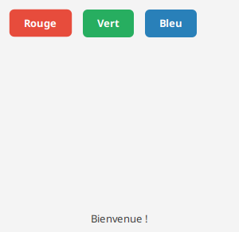

### Découverte du code

1. Ouvrez `src/main/java/fr/univ_amu/iut/exercice3/BoutonCouleur.java`. Vous y trouverez :
   - La structure de classe (`extends Button`) déjà en place
   - Un champ `nbClics` et `couleur` déjà déclarés
   - Un constructeur avec un TODO : il manque le handler `setOnAction` qui incrémente `nbClics`
   - Les accesseurs `getNbClics()`, `nbClicsProperty()`, `getCouleur()` déjà fournis

2. Ouvrez `src/main/java/fr/univ_amu/iut/exercice3/PaletteReactive.java`. Vous y trouverez :
   - La méthode `start()` avec un TODO : construire le `BorderPane`, les trois `BoutonCouleur`, le `Pane zone` et le `Label compteurs`
   - La méthode `createBindings()` avec un TODO : connecter les boutons à la zone et au label via des `ChangeListener` et des `Bindings`

3. Ouvrez `src/test/java/fr/univ_amu/iut/exercice3/BoutonCouleurTest.java` : 7 tests unitaires sur `BoutonCouleur` (convention JavaBeans + compteur)

4. Ouvrez `src/test/java/fr/univ_amu/iut/exercice3/PaletteReactiveTest.java` : 15 tests TestFX sur l'interface graphique complète

### Ce que chaque test valide

**BoutonCouleurTest (7 tests)**

| # | Nom du test | Ce qu'il vérifie | Concept |
|---|---|---|---|
| 1 | `testLeTexteEstCorrect` | `getText()` retourne le texte passé au constructeur | Constructeur `super(texte)` |
| 2 | `testLaCouleurEstStockee` | `getCouleur()` retourne la couleur CSS | Stockage `couleur` |
| 3 | `testNbClicsInitialEstZero` | `getNbClics() == 0` avant tout clic | Valeur initiale de la propriété |
| 4 | `testNbClicsPropertyRetourneUnePropriete` | `nbClicsProperty()` non null et cohérent avec `getNbClics()` | Convention JavaBeans |
| 5 | `testClicIncrementeNbClics` | `btn.fire()` -> `getNbClics() == 1` | Handler `setOnAction` |
| 6 | `testDeuxClicsIncrementent` | `btn.fire()` x2 -> `getNbClics() == 2` | Incrémentation répétée |
| 7 | `testLaPropertyEstLieeAuCompteur` | `nbClicsProperty().get() == 1` après un clic | Cohérence propriété / accesseur |

**PaletteReactiveTest (15 tests)**

| # | Nom du test | Ce qu'il vérifie | Concept |
|---|---|---|---|
| 1 | `laFenetreEstVisible` | `stage.isShowing() == true` | `show()` appelé |
| 2 | `laSceneExiste` | `stage.getScene() != null` | `setScene()` |
| 3 | `laRacineEstUnBorderPane` | racine est un `BorderPane` | Layout racine |
| 4 | `lesTroisBoutonsExistent` | `#btn-rouge`, `#btn-vert`, `#btn-bleu` présents | IDs et textes |
| 5 | `lesBoutonsOntUneCouleur` | couleurs CSS "red", "green", "blue" | `getCouleur()` |
| 6 | `leHBoxDesBoutonsEstEnHaut` | `root.getTop()` est un `HBox` | `BorderPane.setTop()` |
| 7 | `laZoneDeCouleurExiste` | `#zone` est un `Pane` | Pane central |
| 8 | `leLabelCompteursExiste` | `#compteurs` est un `Label` | Label bas |
| 9 | `leTexteInitialAvantClic` | label affiche "Bienvenue !" | `Bindings.when(...).then("Bienvenue !")` |
| 10 | `cliquerRougeMetLaZoneEnRouge` | style contient "red" après clic | `ChangeListener` + `setStyle()` |
| 11 | `cliquerVertMetLaZoneEnVert` | style contient "green" après clic | `ChangeListener` + `setStyle()` |
| 12 | `cliquerIncrementeLeCompteur` | label contient "Rouge: 2" après 2 clics | `Bindings.concat()` |
| 13 | `leTexteBasculeDeBienvenueAuxCompteurs` | label bascule "Bienvenue !" -> "Rouge: 1" | `Bindings.when()` |
| 14 | `lesCompteursSontIndependants` | Rouge=2, Vert=0, Bleu=1 affichés correctement | `nbClics` par bouton |
| 15 | `leLabelEstLieParBinding` | `textProperty().isBound() == true` | `bind()` - pas de `setText()` |

### Travail à faire

1. **Créez une branche** : `git checkout -b exercice3`

2. **Activez les tests 1-7 de `BoutonCouleurTest`** et complétez `BoutonCouleur` :
   - Dans le constructeur `BoutonCouleur(String texte, String couleur)`, ajoutez : `setOnAction(e -> nbClics.set(nbClics.get() + 1));`
   - Pour coller à la maquette, **colorez le bouton** (texte blanc, coins arrondis) en reprenant les teintes du TP1 : `"red"` → `#e74c3c`, `"green"` → `#27ae60`, `"blue"` → `#2980b9` (un `switch` sur `couleur`). On garde le nom CSS (`couleur`) pour `getCouleur()` et la coloration de la zone : `setStyle("-fx-background-color: " + teinteBouton + "; -fx-text-fill: white; -fx-font-weight: bold; -fx-background-radius: 6;")`
   - Le champ `nbClics` et les accesseurs sont déjà fournis
   - Vérifiez : `./mvnw test`

3. **Activez les tests 1-3 de `PaletteReactiveTest`** et implémentez la structure dans `start()` :
   - Créez un `BorderPane root`
   - Créez les trois `BoutonCouleur` avec leurs IDs (`setId("btn-rouge")` etc.)
   - Créez un `HBox` (un peu d'espacement et de padding) et placez-le en `root.setTop()`
   - Créez un `Pane zone` (id "zone", `setMinSize(300, 200)`) en `root.setCenter()`
   - Créez un `Label labelCompteurs` (id "compteurs") en `root.setBottom()`, **centré comme une barre de statut** (`setMaxWidth(Double.MAX_VALUE)` + `setAlignment(Pos.CENTER)`)
   - Appelez `createBindings(...)` puis créez la `Scene` et appelez `show()`

4. **Activez les tests 4-15** et implémentez `createBindings()` :
   - Pour chaque bouton, ajoutez un `ChangeListener` sur `nbClicsProperty()` qui appelle `zone.setStyle("-fx-background-color: " + btn.getCouleur() + ";")`
   - Créez une `StringExpression texteCompteurs` avec `Bindings.concat("Rouge: ", btnRouge.nbClicsProperty().asString(), "  Vert: ", ..., "  Bleu: ", ...)`
   - Créez l'expression conditionnelle avec `Bindings.when(total.isEqualTo(0)).then("Bienvenue !").otherwise(texteCompteurs)` (où `total` est la somme des trois propriétés)
   - Liez : `labelCompteurs.textProperty().bind(texteAvecBienvenue)`

5. **Vérifiez visuellement** : `./mvnw javafx:run`

6. **Finalisez** :

```bash
git add src/main/java/fr/univ_amu/iut/exercice3/
git add src/test/java/fr/univ_amu/iut/exercice3/
git commit -m "feat: exercice 3 - palette reactive avec bindings"
git push -u origin exercice3
```

> [!TIP]
> Si la somme des trois compteurs ne fonctionne pas, demandez à Copilot Chat : `Comment additionner trois IntegerProperty en JavaFX pour obtenir un NumberBinding ?`

---

## Exercice 4 - AireTriangle (★★)

### Objectif

Cet exercice est une **classe de calcul sans interface graphique**. Vous allez modéliser un triangle par ses six coordonnées et calculer son aire via la formule du déterminant. L'objectif est de pratiquer la **convention JavaBeans complète** et les **bindings calculés** avec l'API fluente de JavaFX.

> Consultez les slides [CM2 #25-28](https://iutinfoaix-r202.github.io/cours/cm2-donnees-et-liaison.html#25) (convention JavaBeans), [#45-47](https://iutinfoaix-r202.github.io/cours/cm2-donnees-et-liaison.html#45) (progression API classique → statique → fluente), et [#48-49](https://iutinfoaix-r202.github.io/cours/cm2-donnees-et-liaison.html#48) (exemple complet de l'aire d'un triangle).

### Ce que vous allez découvrir

- La **convention JavaBeans pour les propriétés JavaFX** : pour chaque propriété `foo`, exposer le triplet `getFoo()` / `setFoo()` / `fooProperty()`
- [`IntegerProperty`](https://openjfx.io/javadoc/25/javafx.base/javafx/beans/property/IntegerProperty.html) et l'API fluente : `.multiply()`, `.subtract()`, `.add()`, `.divide()`
- [`NumberBinding`](https://openjfx.io/javadoc/25/javafx.base/javafx/beans/binding/NumberBinding.html) : résultat d'une opération arithmétique entre propriétés
- [`DoubleProperty.bind()`](https://openjfx.io/javadoc/25/javafx.base/javafx/beans/property/DoubleProperty.html) : lier une propriété à un binding calculé
- [`Bindings.when().then().otherwise()`](https://openjfx.io/javadoc/25/javafx.base/javafx/beans/binding/Bindings.html) : valeur absolue réactive (le déterminant peut être négatif)
- [`Bindings.format()`](https://openjfx.io/javadoc/25/javafx.base/javafx/beans/binding/Bindings.html) : formater des propriétés en `StringExpression`

### La convention JavaBeans - concept

La convention JavaBeans est un contrat d'exposition des propriétés JavaFX. Pour chaque propriété nommée `foo` de type `T`, la classe doit exposer trois méthodes :


Ce triplet permet à JavaFX, aux outils (Scene Builder, IntelliJ) et aux frameworks de découvrir et lier les propriétés automatiquement, sans connaître les détails de l'implémentation.

### Le graphe de dépendances du binding


Dès qu'une coordonnée change, JavaFX recalcule automatiquement toute la chaîne jusqu'à `area`. Aucun appel manuel n'est nécessaire.

### Illustration géométrique


**La formule du déterminant :**

```
aire = | x1*(y2-y3) + x2*(y3-y1) + x3*(y1-y2) | / 2
```

### Découverte du code

1. Ouvrez `src/main/java/fr/univ_amu/iut/exercice4/AireTriangle.java`. Vous y trouverez :
   - Six `IntegerProperty` déjà déclarées avec `new SimpleIntegerProperty(0)`
   - Une `DoubleProperty area` déjà déclarée
   - Une méthode `createBinding()` à compléter : calculer `area` par la formule du déterminant
   - Les accesseurs JavaBeans pour toutes les coordonnées et pour `area` déjà implémentés
   - Une méthode `printResult()` à compléter : afficher la `StringExpression output`

2. Ouvrez `src/test/java/fr/univ_amu/iut/exercice4/AireTriangleTest.java` :
   - Les tests 1-2 vérifient les accesseurs JavaBeans
   - Les tests 3-6 vérifient l'exactitude du calcul d'aire pour plusieurs triangles
   - Le test 7 vérifie que l'aire est toujours positive (valeur absolue)
   - Le test 8 vérifie le recalcul automatique quand une coordonnée change
   - Le test 9 vérifie que `areaProperty().isBound()` retourne `true`
   - Le test 10 vérifie la sortie de `printResult()`

### Ce que chaque test valide

| # | Nom du test | Ce qu'il vérifie | Concept |
|---|---|---|---|
| 1 | `testLesProprietesSontInitialiseesAZero` | Toutes les coordonnées valent 0 | Initialisation |
| 2 | `testLesProprietesJavaBeansFonctionnent` | `setX1(5)` -> `getX1()==5` et `x1Property().get()==5` | Convention JavaBeans |
| 3 | `testTriangleVideAireZero` | `getArea() == 0.0` pour un triangle dégénéré | Formule - cas de base |
| 4 | `testTriangleUniteAireZeroVirguleCinq` | P1(0,0) P2(1,0) P3(0,1) -> aire = 0.5 | Formule - triangle unité |
| 5 | `testTriangleCorrectArea` | P1(0,0) P2(6,0) P3(4,3) -> aire = 9.0 | Formule - cas général |
| 6 | `testTriangleDeuxiemeCorrectArea` | P1(1,0) P2(2,2) P3(0,1) -> aire = 1.5 | Formule - autre triangle |
| 7 | `testAirePositiveMemeAvecDeterminantNegatif` | Ordre inversé des points -> aire > 0 | Valeur absolue |
| 8 | `testModifierCoordonneeRecalculeAire` | Changer P2 et P3 -> aire recalculée | Recalcul automatique |
| 9 | `testAreaPropertyEstLiee` | `areaProperty().isBound() == true` | `bind()` correctement appelé |
| 10 | `testPrintResultAfficheLeTexteAttendu` | Sortie contient "P1(", "P2(", "P3(", "aire" | `Bindings.format()` |

### Travail à faire

1. **Créez une branche** : `git checkout -b exercice4`

2. **Activez les tests 1-2** - les accesseurs sont déjà fournis, ils doivent passer sans modification : `./mvnw test`

3. **Activez les tests 3-9** et implémentez `createBinding()` :
   - Calculez le déterminant avec l'API fluente :
     ```java
     NumberBinding determinant =
         x1.multiply(y2).subtract(x1.multiply(y3))
           .add(x2.multiply(y3)).subtract(x2.multiply(y1))
           .add(x3.multiply(y1)).subtract(x3.multiply(y2));
     ```
   - Liez `area` à la valeur absolue divisée par 2 :
     ```java
     area.bind(
         Bindings.when(determinant.greaterThanOrEqualTo(0))
             .then(determinant.divide(2.0))
             .otherwise(determinant.negate().divide(2.0)));
     ```

4. **Activez le test 10** et implémentez `printResult()` et la `StringExpression output` :
   - Dans `createBinding()`, ajoutez : `output = Bindings.format("P1(%s,%s) P2(%s,%s) P3(%s,%s) => aire = %s", x1, y1, x2, y2, x3, y3, area);`
   - Dans `printResult()` : `System.out.println(output.get());`

5. **Vérifiez** : `./mvnw test`

6. **Finalisez** :

```bash
git add src/main/java/fr/univ_amu/iut/exercice4/
git add src/test/java/fr/univ_amu/iut/exercice4/
git commit -m "feat: exercice 4 - modele AireTriangle avec bindings calcules"
git push -u origin exercice4
```

> [!TIP]
> Si vous avez du mal à exprimer la valeur absolue avec les bindings, demandez à Copilot Chat : `Comment calculer la valeur absolue d'un NumberBinding en JavaFX sans utiliser Math.abs() ?`

---

## Exercice 5 - CalculatriceTriangle (★★★)

### Objectif

Cet exercice construit une **interface graphique** qui réutilise la classe `AireTriangle` (exercice 4) pour les calculs. Six `Slider` permettent de modifier les coordonnées du triangle, un `TextField` affiche l'aire mise à jour automatiquement, et un `Pane` dessine le triangle avec trois `Line` dont les positions sont liées aux coordonnées du triangle.

C'est une illustration concrète de la **puissance des bindings** : `AireTriangle` ne contient aucun code d'affichage, l'interface ne refait aucun calcul, et tout reste synchronisé automatiquement par les liaisons.

### Ce que vous allez découvrir

- [`Slider`](https://openjfx.io/javadoc/25/javafx.controls/javafx/scene/control/Slider.html) et sa propriété [`valueProperty()`](https://openjfx.io/javadoc/25/javafx.controls/javafx/scene/control/Slider.html#valueProperty()) : un contrôle numérique glissant avec `showTickLabels`, `showTickMarks`, `snapToTicks`
- [`TextField`](https://openjfx.io/javadoc/25/javafx.controls/javafx/scene/control/TextField.html) non éditable, dont `textProperty()` est lié par binding
- [`Line`](https://openjfx.io/javadoc/25/javafx.graphics/javafx/scene/shape/Line.html) et ses propriétés `startXProperty()`, `startYProperty()`, `endXProperty()`, `endYProperty()` liées aux coordonnées du triangle
- Le **facteur d'échelle** : les coordonnées du triangle (entiers) sont converties en pixels par multiplication

### Schéma des liaisons (bindings)


### Maquette à reproduire

Voici l'interface que vous devez construire :


**Le rendu final** (votre objectif une fois l'exercice terminé, à comparer avec la maquette ci-dessus) :

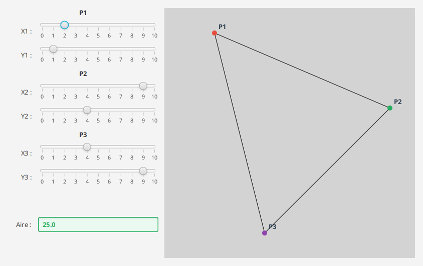

Le facteur d'échelle est 50 : chaque slider varie de **0 à 10**, ce qui correspond à **0 à 500 px** sur le panneau de dessin (500 × 500). Ainsi, si `x1 = 5`, la ligne part de `5 * 50 = 250` pixels depuis le bord gauche du panneau. Les sliders ont des valeurs initiales non nulles, pour qu'un triangle soit dessiné dès l'ouverture (sinon les trois points sont confondus en (0, 0) et le panneau paraît vide).

### Découverte du code

1. Ouvrez `src/main/java/fr/univ_amu/iut/exercice5/CalculatriceTriangle.java`. Vous y trouverez :
   - La structure `Application` avec `start()` à compléter
   - Un champ `AireTriangle modele` déjà déclaré
   - Des TODO détaillés pour chaque étape

2. Ouvrez `src/test/java/fr/univ_amu/iut/exercice5/CalculatriceTriangleTest.java` :
   - Les tests 1-3 vérifient la fenêtre et le layout (`GridPane`)
   - Les tests 4-5 vérifient les 6 sliders (existence + `showTickLabels/Marks/SnapToTicks`)
   - Les tests 6-8 vérifient le `TextField` aire (existence, non éditable, lié par binding)
   - Les tests 9-10 vérifient le panneau de dessin (existence + 3 `Line`)
   - Le test 11 vérifie que bouger le slider met à jour les coordonnées des lignes
   - Le test 12 vérifie un calcul d'aire connu

### Ce que chaque test valide

| # | Nom du test | Ce qu'il vérifie | Concept |
|---|---|---|---|
| 1 | `laFenetreEstVisible` | `stage.isShowing()` | Affichage |
| 2 | `laSceneExiste` | `stage.getScene() != null` | Scene |
| 3 | `laRacineEstUnGridPane` | racine est un `GridPane` | Layout |
| 4 | `lesSixSlidersExistent` | `#slider-x1` ... `#slider-y3` présents | IDs sliders |
| 5 | `lesSlidersOntDesTickMarks` | `showTickLabels`, `showTickMarks`, `snapToTicks` = true | Config slider |
| 6 | `leTextFieldAireExiste` | `#aire` existe et `isEditable() == false` | TextField non editable |
| 7 | `leTextFieldAireEstLieParBinding` | `textProperty().isBound() == true` | `bind()` |
| 8 | `deplacerSliderModifieAire` | P1(0,0) P2(6,0) P3(0,3) -> TextField contient "9" | Synchronisation par binding |
| 9 | `lePanneauDessinExiste` | `#dessin` est un `Pane` | Pane de dessin |
| 10 | `lesTroisLignesExistent` | 3 objets `Line` dans `#dessin` | Dessin du triangle |
| 11 | `deplacerSliderModifieLeDessin` | sx1=5, sy1=3 -> `startX=250`, `startY=150` | Binding coords * 50 |
| 12 | `aireCorrectePourTriangleConnu` | P1(0,0) P2(1,0) P3(0,1) -> "0.5" | Calcul correct |

### Travail à faire

1. **Créez une branche** : `git checkout -b exercice5`

2. **Activez les tests 1-3** et créez la structure de la fenêtre :
   - `GridPane root` comme racine
   - `Scene` + `stage.show()`

3. **Activez les tests 4-5** et ajoutez les 6 sliders :
   - Pour chaque coordonnée : `Slider s = new Slider(0, 10, valeurInitiale)` avec `setId("slider-x1")` etc. (les valeurs initiales sont déjà fixées dans les champs)
   - Configurez `setShowTickLabels(true)`, `setShowTickMarks(true)`, `setSnapToTicks(true)`
   - Ajoutez label + slider dans le `GridPane`

4. **Activez les tests 6-8** et ajoutez le `TextField` aire :
   - `TextField tfAire = new TextField()` avec `setId("aire")` et `setEditable(false)`
   - Pour coller à la maquette, **colorez le champ en vert** : `setStyle("-fx-control-inner-background: #eafaf1; -fx-text-fill: #27ae60; -fx-font-weight: bold; -fx-border-color: #27ae60; -fx-border-width: 1.5; -fx-border-radius: 3; -fx-background-radius: 3;")`
   - Liez : `tfAire.textProperty().bind(modele.areaProperty().asString())`
   - Liez les sliders au modèle : `sliderX1.valueProperty().bindBidirectional(modele.x1Property())`

5. **Activez les tests 9-12** et ajoutez le panneau de dessin avec les 3 lignes :
   - `Pane dessin = new Pane()` avec `setId("dessin")`
   - Créez 3 objets `Line` et liez leurs coordonnées aux propriétés du modèle multipliées par 50 :
     ```java
     Line l1 = new Line();
     l1.startXProperty().bind(modele.x1Property().multiply(50));
     l1.startYProperty().bind(modele.y1Property().multiply(50));
     l1.endXProperty().bind(modele.x2Property().multiply(50));
     l1.endYProperty().bind(modele.y2Property().multiply(50));
     ```
   - Ajoutez les 3 lignes à `dessin.getChildren()`
   - Pour coller à la maquette, ajoutez **par-dessus les lignes** un **marqueur coloré** à chaque sommet (`Circle` de rayon 5 : P1 `#e74c3c`, P2 `#27ae60`, P3 `#8e44ad`) et une **étiquette** `Text` « P1 » / « P2 » / « P3 ». Liez leurs positions au modèle comme les lignes (`marqueurP1.centerXProperty().bind(modele.x1Property().multiply(50))`, etc. ; pour les étiquettes, décalez de quelques pixels avec `.add(8)` / `.subtract(8)`).

6. **Vérifiez visuellement** : `./mvnw javafx:run`

7. **Finalisez** :

```bash
git add src/main/java/fr/univ_amu/iut/exercice5/
git add src/test/java/fr/univ_amu/iut/exercice5/
git commit -m "feat: exercice 5 - calculatrice triangle avec sliders et dessin"
git push -u origin exercice5
```

> [!TIP]
> Si le triangle ne se dessine pas correctement après le binding, demandez à Copilot Chat : `Comment lier les coordonnées d'une Line JavaFX aux propriétés d'un modèle avec un facteur d'échelle ?`

---

## Exercice 6 - FormulaireConnexion (★★★)

### Objectif

Cet exercice introduit les **bindings de bas niveau** via la classe abstraite `BooleanBinding` avec redéfinition de `computeValue()`. Vous construirez un formulaire de connexion dont les contrôles se désactivent ou s'activent automatiquement selon des règles de validation.

Ce pattern est directement lié au concept d'**affordance** vu en CM2 : un bouton grisé communique visuellement à l'utilisateur que l'action n'est pas encore disponible. Ce principe fait partie des heuristiques d'ergonomie de Nielsen (visibilité de l'état du système + prévention des erreurs).

> Consultez les slides [CM2 #53](https://iutinfoaix-r202.github.io/cours/cm2-donnees-et-liaison.html#53) (conditions booléennes : comparaisons et combinaisons), [#54-55](https://iutinfoaix-r202.github.io/cours/cm2-donnees-et-liaison.html#54) (`BooleanBinding.computeValue()`), [#56](https://iutinfoaix-r202.github.io/cours/cm2-donnees-et-liaison.html#56) (validation login), et [#64-66](https://iutinfoaix-r202.github.io/cours/cm2-donnees-et-liaison.html#64) (affordance de Don Norman).

### Ce que vous allez découvrir

- [`BooleanBinding`](https://openjfx.io/javadoc/25/javafx.base/javafx/beans/binding/BooleanBinding.html) avec redéfinition de `computeValue()` : créer un binding personnalisé avec une logique métier arbitraire
- [`super.bind(dependencies...)`](https://openjfx.io/javadoc/25/javafx.base/javafx/beans/binding/BooleanBinding.html#bind(javafx.beans.Observable...)) : déclarer les dépendances du binding de bas niveau pour que JavaFX sache quand recalculer
- [`Node.disableProperty()`](https://openjfx.io/javadoc/25/javafx.graphics/javafx/scene/Node.html#disableProperty()) : désactiver un contrôle réactivement via binding
- [`TextInputControl.editableProperty()`](https://openjfx.io/javadoc/25/javafx.controls/javafx/scene/control/TextInputControl.html#editableProperty()) : rendre un champ non éditable réactivement
- [`PasswordField`](https://openjfx.io/javadoc/25/javafx.controls/javafx/scene/control/PasswordField.html) : champ de saisie masquée

### L'affordance et le binding - concept

L'affordance est la propriété d'un objet qui suggère son utilisation. En IHM, désactiver un bouton tant que les conditions ne sont pas remplies est une forme d'affordance : l'utilisateur comprend immédiatement ce qu'il doit faire pour pouvoir cliquer.


**Insight clé :** `BooleanBinding.computeValue()` est appelé automatiquement par JavaFX chaque fois qu'une dépendance déclarée change. Vous n'avez jamais à appeler `valider()` ni `rafraichir()`.

### Maquette à reproduire

Voici l'interface que vous devez construire :


**Le rendu final** (votre objectif une fois l'exercice terminé, à comparer avec la maquette ci-dessus) :

Comme la maquette, deux états : à gauche le formulaire **vide** (mot de passe non éditable, boutons désactivés) ; à droite le formulaire **valide** (OK vert actif, Annuler rouge, message de bienvenue).

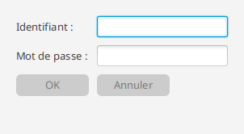 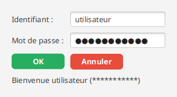

### Les règles de validation

1. `userId.length >= 6` - rend le `PasswordField` editable
2. `pwd.length >= 8` ET `pwd` contient au moins une majuscule ET un chiffre - active le bouton OK
3. `userId` ou `pwd` non vide - active le bouton Annuler
4. Clic sur Annuler - vide les deux champs
5. Clic sur OK (valide) - affiche un message de bienvenue avec le mot de passe masqué

### Découverte du code

1. Ouvrez `src/main/java/fr/univ_amu/iut/exercice6/FormulaireConnexion.java`. Vous y trouverez la structure `Application` avec `start()` à implémenter.

2. Ouvrez `src/test/java/fr/univ_amu/iut/exercice6/FormulaireConnexionTest.java` :
   - Le test cherche `#user-id` (TextField), `#pwd` (PasswordField), `#btn-ok`, `#btn-cancel`, `#message`
   - Les tests 4-6 vérifient les règles de longueur de l'identifiant pour rendre le mot de passe editable
   - Les tests 7-11 vérifient les règles de validité du mot de passe pour activer le bouton OK
   - Les tests 12-13 vérifient le bouton Annuler
   - Le test 14 vérifie que Annuler vide les champs
   - Le test 15 vérifie le message affiché après un clic OK valide

### Ce que chaque test valide

| # | Nom du test | Ce qu'il vérifie | Concept |
|---|---|---|---|
| 1 | `laFenetreEstVisible` | `stage.isShowing()` | Affichage |
| 2 | `leChampIdentifiantExiste` | `#user-id` existe | TextField |
| 3 | `leChampMotDePasseExiste` | `#pwd` est un `PasswordField` | PasswordField |
| 4 | `leChampMotDePasseEstNonEditableAuDebut` | `pwd.isEditable() == false` | `editableProperty()` lié |
| 5 | `saisirSixCaracteresRendMotDePasseEditable` | userId="abcdef" -> `pwd.isEditable() == true` | Binding longueur >= 6 |
| 6 | `cinqCaracteresNeSuffitPas` | userId="abcde" -> `pwd.isEditable() == false` | Seuil strict >= 6 |
| 7 | `boutonOkDesactiveInitialement` | `btn-ok.isDisabled() == true` | `disableProperty()` lié |
| 8 | `boutonOkDesactiveSiMotDePasseTropCourt` | pwd="Ab1" (<8 chars) -> OK désactivé | Longueur minimale 8 |
| 9 | `motDePasseSansChiffreGardeOkDesactive` | pwd="Abcdefgh" (sans chiffre) -> OK désactivé | Chiffre obligatoire |
| 10 | `motDePasseSansMajusculeGardeOkDesactive` | pwd="abcdefg1" (sans majusc.) -> OK désactivé | Majuscule obligatoire |
| 11 | `motDePasseValideActiveOk` | pwd="Abcdefg1" -> OK actif | Toutes les règles |
| 12 | `boutonAnnulerDesactiveSiChampsVides` | Annuler désactivé si les deux champs vides | `disableProperty()` |
| 13 | `boutonAnnulerActifSiUnChampRempli` | userId="a" -> Annuler actif | Union des deux propriétés |
| 14 | `boutonAnnulerVideLesChamps` | Clic Annuler -> userId="" et pwd="" | Handler |
| 15 | `boutonOkAfficheLMessage` | Clic OK -> message contient userId + "********" | Label message |

### Travail à faire

1. **Créez une branche** : `git checkout -b exercice6`

2. **Activez les tests 1-3** et créez la structure de base : `TextField` (id "user-id"), `PasswordField` (id "pwd"), `Button` (id "btn-ok"), `Button` (id "btn-cancel"), `Label` (id "message")

3. **Activez les tests 4-6** : liez `pwd.editableProperty()` à un binding sur la longueur de `userId` :
   ```java
   pwd.editableProperty().bind(userId.textProperty().length().greaterThanOrEqualTo(6));
   ```

4. **Activez les tests 7-11** : créez le `BooleanBinding` de bas niveau pour la validité du formulaire :
   ```java
   BooleanBinding formValide = new BooleanBinding() {
       { super.bind(userId.textProperty(), pwd.textProperty()); }
       @Override
       protected boolean computeValue() {
           String p = pwd.getText();
           return userId.getText().length() >= 6
               && p.length() >= 8
               && p.chars().anyMatch(Character::isUpperCase)
               && p.chars().anyMatch(Character::isDigit);
       }
   };
   btnOk.disableProperty().bind(formValide.not());
   ```

5. **Activez les tests 12-13** : liez `btnCancel.disableProperty()` à l'absence de texte dans les deux champs :
   ```java
   btnCancel.disableProperty().bind(
       userId.textProperty().isEmpty().and(pwd.textProperty().isEmpty()));
   ```

6. **Activez les tests 14-15** : ajoutez les handlers de clic :
   - Annuler : `userId.clear(); pwd.clear();`
   - OK : `labelMessage.setText("Bienvenue " + userId.getText() + " (" + "*".repeat(pwd.getText().length()) + ")");`

7. **Style des boutons (cf. maquette, non testé)** : **gris** tant qu'ils sont désactivés, puis **vert (OK)** / **rouge (Annuler)** une fois actifs. On lie `styleProperty()` à `disabledProperty()` :
   ```java
   String gris = "-fx-background-color: #cccccc; -fx-text-fill: #777777; -fx-background-radius: 6; -fx-opacity: 1;";
   btnOk.styleProperty().bind(Bindings.when(btnOk.disabledProperty())
       .then(gris)
       .otherwise("-fx-background-color: #27ae60; -fx-text-fill: white; -fx-font-weight: bold; -fx-background-radius: 6;"));
   // idem pour btnCancel avec #e74c3c
   ```

7. **Vérifiez** : `./mvnw javafx:run` et `./mvnw test`

8. **Finalisez** :

```bash
git add src/main/java/fr/univ_amu/iut/exercice6/
git add src/test/java/fr/univ_amu/iut/exercice6/
git commit -m "feat: exercice 6 - formulaire connexion avec BooleanBinding"
git push -u origin exercice6
```

> [!TIP]
> Si `computeValue()` n'est pas appelé automatiquement quand le texte change, vérifiez que vous avez bien déclaré les dépendances dans `super.bind(...)`. Demandez à Copilot Chat : `Pourquoi mon BooleanBinding ne se recalcule pas quand le TextField change ?`

---

## Exercice 7 - CercleInteractif (★★★)

### Objectif

Cet exercice synchronise **trois contrôles** sur une même valeur : un `Circle` dont le rayon varie, un `Slider` pour le régler, et un `TextField` pour le saisir. Changer l'un des trois met à jour les deux autres automatiquement, dans les deux sens. C'est le **binding bidirectionnel**.

### Ce que vous allez découvrir

- [`Property.bindBidirectional(Property)`](https://openjfx.io/javadoc/25/javafx.base/javafx/beans/property/Property.html#bindBidirectional(javafx.beans.property.Property)) : liaison dans les deux sens entre deux propriétés de même type
- [`NumberStringConverter`](https://openjfx.io/javadoc/25/javafx.base/javafx/util/converter/NumberStringConverter.html) : convertisseur bidirectionnel `Number` <-> `String` pour relier un `TextField` (type `String`) à une propriété numérique
- [`TextFormatter`](https://openjfx.io/javadoc/25/javafx.controls/javafx/scene/control/TextFormatter.html) : pont de types entre `TextField` et `DoubleProperty`
- [`Circle.radiusProperty()`](https://openjfx.io/javadoc/25/javafx.graphics/javafx/scene/shape/Circle.html#radiusProperty()) : la propriété du rayon du cercle
- [`Pane.widthProperty()` / `heightProperty()`](https://openjfx.io/javadoc/25/javafx.graphics/javafx/scene/layout/Region.html#widthProperty()) : pour centrer le cercle par binding

### `bind` vs `bindBidirectional` - concept

La différence entre les deux modes de liaison est fondamentale :


- `bind()` : la cible suit la source. La cible ne peut pas être modifiée directement.
- `bindBidirectional()` : les deux propriétés restent indépendantes mais se synchronisent mutuellement. Modifier l'une met à jour l'autre, et vice versa.

**Contrainte de type :** `bindBidirectional` ne fonctionne qu'entre deux propriétés du **même type**. Pour relier un `TextField` (`StringProperty`) à un `Slider` (`DoubleProperty`), il faut un convertisseur. C'est le rôle du `TextFormatter<Double>` avec un `NumberStringConverter`.

### Maquette à reproduire

Voici l'interface que vous devez construire :


**Le rendu final** (votre objectif une fois l'exercice terminé, à comparer avec la maquette ci-dessus) :

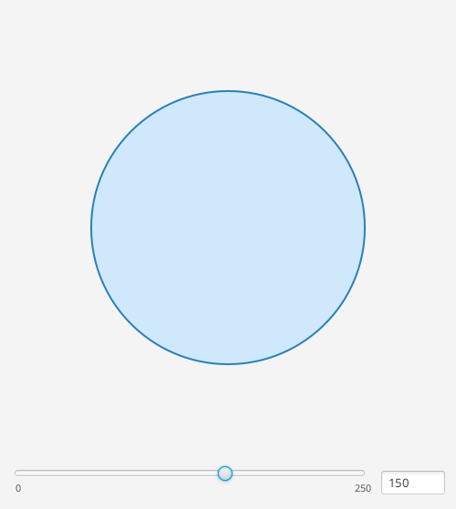

Le cercle est centré dans le panneau par binding (`centerX.bind(pane.widthProperty().divide(2))`), le slider a une valeur max de 250, et le rayon initial est 150.

### Découverte du code

1. Ouvrez `src/main/java/fr/univ_amu/iut/exercice7/CercleInteractif.java` : structure `Application` avec `start()` à implémenter.

2. Ouvrez `src/test/java/fr/univ_amu/iut/exercice7/CercleInteractifTest.java` :
   - Tests 1-4 : existence des composants (`#cercle`, `#slider`, `#rayon`)
   - Test 5 : rayon initial = 150, slider initial = 150
   - Tests 6-7 : bouger le slider -> cercle et TextField mis à jour
   - Test 8 : modifier le TextField -> slider et cercle mis à jour
   - Test 9 : `centerX` et `centerY` du cercle sont liés par `bind()`

### Ce que chaque test valide

| # | Nom du test | Ce qu'il vérifie | Concept |
|---|---|---|---|
| 1 | `laFenetreEstVisible` | `stage.isShowing()` | Affichage |
| 2 | `leCercleExiste` | `#cercle` est un `Circle` | Circle avec id |
| 3 | `leSliderExiste` | `#slider` existe et `max == 250` | Slider avec max |
| 4 | `leTextFieldExiste` | `#rayon` existe | TextField |
| 5 | `rayonInitialEst150` | `cercle.radius == 150` et `slider.value == 150` | Valeur initiale |
| 6 | `deplacerSliderModifieLeCercle` | `slider=100` -> `cercle.radius ~= 100` | `bindBidirectional` slider-cercle |
| 7 | `deplacerSliderModifieLeTextField` | `slider=200` -> `tf` contient "200" | `bindBidirectional` slider-tf |
| 8 | `leTextFieldModifieLeSliderEtLeCercle` | `tf="75"` -> `slider ~= 75` et `radius ~= 75` | Bidirectionnel tf->slider->cercle |
| 9 | `leCercleEstCentreDansLePanneau` | `centerXProperty().isBound() == true` et idem `centerY` | Centrage par `bind()` |

### Travail à faire

1. **Créez une branche** : `git checkout -b exercice7`

2. **Activez les tests 1-4** et créez les composants de base :
   - `Circle cercle = new Circle(150)` avec `setId("cercle")`. Pour coller à la maquette, donnez-lui un **fond bleu clair et un contour bleu** : `cercle.setFill(Color.web("#cfe8fb"))` et `cercle.setStroke(Color.web("#2980b9"))` (sinon le cercle est noir par défaut).
   - `Slider slider = new Slider(0, 250, 150)` avec `setId("slider")`. Pour coller à la maquette, **affichez ses bornes 0 / 250** (`setShowTickLabels(true)`, `setMajorTickUnit(250)`, `setMinorTickCount(0)`, `setShowTickMarks(false)`) et placez-le **en bas**, à côté du champ rayon (un `HBox` : slider qui s'étire via `HBox.setHgrow(slider, Priority.ALWAYS)` + le `TextField` à droite).
   - `TextField tfRayon = new TextField()` avec `setId("rayon")` (largeur réduite, ex. `setMaxWidth(70)`)

3. **Activez les tests 5-7** et liez le slider au cercle :
   ```java
   slider.valueProperty().bindBidirectional(cercle.radiusProperty());
   ```
   Puis liez le `TextField` via un `TextFormatter` :
   ```java
   TextFormatter<Double> formatter = new TextFormatter<>(new NumberStringConverter());
   tfRayon.setTextFormatter(formatter);
   formatter.valueProperty().bindBidirectional(cercle.radiusProperty().asObject());
   ```

4. **Activez le test 8** : vérifiez que la saisie dans le TextField met à jour le slider et le cercle. Si le binding bidirectionnel est correctement déclaré, cela fonctionne automatiquement.

5. **Activez le test 9** et centrez le cercle par binding :
   ```java
   Pane panneau = new Pane(cercle);
   cercle.centerXProperty().bind(panneau.widthProperty().divide(2));
   cercle.centerYProperty().bind(panneau.heightProperty().divide(2));
   ```

6. **Vérifiez** : `./mvnw javafx:run` et `./mvnw test`

7. **Finalisez** :

```bash
git add src/main/java/fr/univ_amu/iut/exercice7/
git add src/test/java/fr/univ_amu/iut/exercice7/
git commit -m "feat: exercice 7 - cercle interactif avec binding bidirectionnel"
git push -u origin exercice7
```

> [!TIP]
> Si modifier le TextField ne met pas à jour le slider, vérifiez que vous avez bien utilisé `formatter.valueProperty().bindBidirectional(...)` et non `textProperty().bindBidirectional(...)`. Demandez à Copilot Chat : `Comment lier un TextField JavaFX à une DoubleProperty avec TextFormatter ?`

---

## Exercice 8 - ConvertisseurTemperatures (★★★★)

### Objectif

Cet exercice est le **capstone du TP** : il mobilise tous les types de bindings vus jusqu'ici dans une application complète de conversion de températures entre Celsius et Fahrenheit. Deux panneaux contiennent chacun un slider et un champ texte synchronisés, avec conversion par formule dans les deux sens.

La formule de conversion : `F = C * 9/5 + 32` (et l'inverse `C = (F - 32) * 5/9`).

### Ce que vous allez découvrir

- Combinaison de `bindBidirectional` et de `ChangeListener` dans la même application
- La problématique des **boucles infinies** quand deux propriétés se mettent à jour mutuellement
- [`Slider`](https://openjfx.io/javadoc/25/javafx.controls/javafx/scene/control/Slider.html) avec les plages appropriées (Celsius : 0 a 100, Fahrenheit : 32 a 212 selon les tests)
- `TextFormatter` + `NumberStringConverter` pour les `TextField`
- Le motif **"updating flag"** pour éviter les appels en cascade

### Le problème des boucles infinies - concept

Quand deux propriétés se synchronisent mutuellement via `ChangeListener`, il y a un risque de boucle infinie : modifier A declenche le listener qui modifie B, qui declenche le listener qui modifie A, a l'infini.


Le motif classique pour eviter cela est le **drapeau "en cours de mise a jour"** :

```java
private boolean updating = false;

celsius.addListener((obs, old, newVal) -> {
    if (!updating) {
        updating = true;
        fahrenheit.set(newVal.doubleValue() * 9.0 / 5.0 + 32);
        updating = false;
    }
});
```

Sans ce drapeau, le listener sur `celsius` modifie `fahrenheit`, qui declenche le listener sur `fahrenheit`, qui remodifie `celsius`, etc. Avec le drapeau, la boucle s'arrête apres la première propagation.

### Maquette à reproduire

Voici l'interface que vous devez construire :


**Le rendu final** (votre objectif une fois l'exercice terminé, à comparer avec la maquette ci-dessus) :

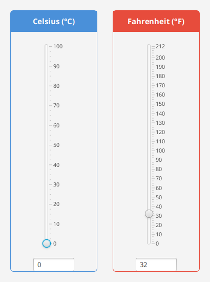

### Découverte du code

1. Ouvrez `src/main/java/fr/univ_amu/iut/exercice8/ConvertisseurTemperatures.java` : structure `Application` avec `start()` a implémenter.

2. Ouvrez `src/test/java/fr/univ_amu/iut/exercice8/ConvertisseurTemperaturesTest.java` :
   - Tests 2-3 : `#slider-celsius` (max=100) et `#slider-fahrenheit` (max=212) existent
   - Tests 4-5 : `#tf-celsius` et `#tf-fahrenheit` existent, valeurs initiales celsius=0, fahrenheit=32
   - Tests 6-7 : conversion dans les deux sens (Celsius -> Fahrenheit et retour)
   - Tests 8, 10 : TextField synchronisé avec son slider
   - Test 9 : conversion d'une valeur intermediaire (37°C = 98.6°F)
   - Test 11 : aller-retour (50°C -> 122°F, puis 32°F -> 0°C)

### Ce que chaque test valide

| # | Nom du test | Ce qu'il vérifie | Concept |
|---|---|---|---|
| 1 | `laFenetreEstVisible` | `stage.isShowing()` | Affichage |
| 2 | `leSliderCelsiusExiste` | `#slider-celsius` et `max == 100` | Slider Celsius |
| 3 | `leSliderFahrenheitExiste` | `#slider-fahrenheit` et `max == 212` | Slider Fahrenheit |
| 4 | `lesTextFieldsExistent` | `#tf-celsius` et `#tf-fahrenheit` existent | TextFields |
| 5 | `valeurInitialeCorrecte` | celsius=0, fahrenheit=32 | 0°C = 32°F |
| 6 | `deplacerCelsiusMetAJourFahrenheit` | celsius=100 -> fahrenheit ~= 212 | C -> F |
| 7 | `deplacerFahrenheitMetAJourCelsius` | fahrenheit=212 -> celsius ~= 100 | F -> C |
| 8 | `textFieldCelsiusSynchroAvecSlider` | slider=50 -> tfCelsius contient "50" | TextField synchro |
| 9 | `conversionCorrecteValeurIntermediaire` | 37°C -> 98.6°F | Formule exacte |
| 10 | `textFieldFahrenheitSynchroAvecSlider` | sliderF=100 -> tfFahrenheit contient "100" | TextField synchro |
| 11 | `conversionAllerRetour` | 50°C -> 122°F, puis 32°F -> 0°C | Boucle d'aller-retour |

### Travail à faire

1. **Créez une branche** : `git checkout -b exercice8`

2. **Activez les tests 1-5** et créez la structure de base :
   - `Slider sliderC = new Slider(0, 100, 0)` avec `setId("slider-celsius")`
   - `Slider sliderF = new Slider(32, 212, 32)` avec `setId("slider-fahrenheit")`
   - `TextField tfC` (id "tf-celsius") et `TextField tfF` (id "tf-fahrenheit")
   - Liez les TextFields aux sliders via `TextFormatter` + `NumberStringConverter` + `bindBidirectional`

3. **Activez les tests 6-7** et implémentez la conversion bidirectionnelle avec le drapeau anti-boucle :
   ```java
   private boolean updating = false;

   sliderC.valueProperty().addListener((obs, old, newVal) -> {
       if (!updating) {
           updating = true;
           sliderF.setValue(newVal.doubleValue() * 9.0 / 5.0 + 32);
           updating = false;
       }
   });
   sliderF.valueProperty().addListener((obs, old, newVal) -> {
       if (!updating) {
           updating = true;
           sliderC.setValue((newVal.doubleValue() - 32) * 5.0 / 9.0);
           updating = false;
       }
   });
   ```

4. **Activez les tests 8-11** : vérifiez que les TextFields restent synchronisés après les conversions. Si le binding bidirectionnel entre les TextFields et les sliders est en place depuis l'étape 2, cela doit fonctionner automatiquement.

5. **Style (pour coller à la maquette, non testé)** : chaque slider + champ vit dans un panneau (`VBox` centré, bordé). En tête de chaque panneau, un `Label` pleine largeur sert d'**en-tête de carte coloré** : « Celsius (°C) » sur fond bleu `#4a90d9`, « Fahrenheit (°F) » sur fond rouge `#e74c3c`, texte blanc gras (`label.setMaxWidth(Double.MAX_VALUE)` + `setStyle("-fx-background-color: #4a90d9; -fx-text-fill: white; ... -fx-alignment: center;")`). Donnez la **même largeur aux deux cartes** (`setPrefWidth(170)` sur chaque `VBox`) pour qu'elles soient symétriques.

5. **Vérifiez** : `./mvnw javafx:run` et `./mvnw test`

6. **Finalisez** :

```bash
git add src/main/java/fr/univ_amu/iut/exercice8/
git add src/test/java/fr/univ_amu/iut/exercice8/
git commit -m "feat: exercice 8 - convertisseur temperatures capstone"
git push -u origin exercice8
```

> [!TIP]
> Si vous avez une `StackOverflowError` ou des comportements instables, c'est probablement une boucle infinie. Ajoutez le drapeau `updating` comme expliqué ci-dessus. Demandez a Copilot Chat : `Comment eviter une boucle infinie entre deux ChangeListener qui se mettent a jour mutuellement en JavaFX ?`

---

Ces exercices sont facultatifs et s'adressent à celles et ceux qui souhaitent aller plus loin. Ils ne sont pas évalués dans le barème standard mais peuvent rapporter des points supplémentaires.

---

## Bonus 9 - BalleRebondissante (★★★★)

### Maquette à reproduire

Voici l'interface que vous devez construire :


**Le rendu final** (votre objectif une fois l'exercice terminé, à comparer avec la maquette ci-dessus) :

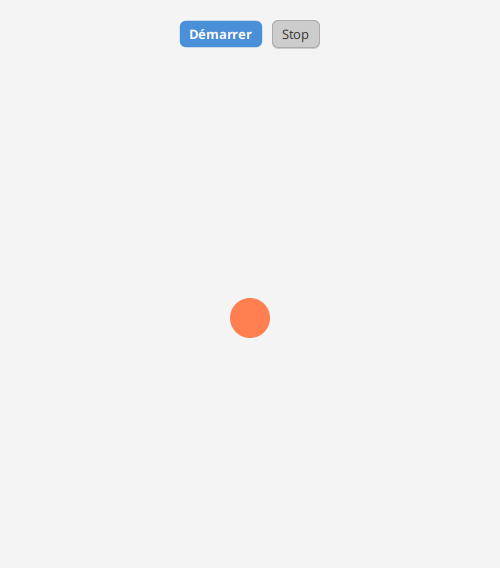

### Objectif

Animer une balle qui rebondit sur les bords d'une fenêtre. Cet exercice introduit `AnimationTimer` et `Bindings.when().then().otherwise()` pour inverser la direction au rebond.

### Ce que vous allez découvrir

- [`AnimationTimer`](https://openjfx.io/javadoc/25/javafx.graphics/javafx/animation/AnimationTimer.html) : callback appelé a chaque image (60 fps), avec timestamp en nanosecondes
- [`Bindings.when(condition).then(valA).otherwise(valB)`](https://openjfx.io/javadoc/25/javafx.base/javafx/beans/binding/Bindings.html) : sélection conditionnelle réactive, ici pour inverser le signe de la vitesse au rebond
- La logique de rebond exprimée de manière déclarative via bindings

**Différence avec le TP1 :** le TP1 utilisait `TranslateTransition` (animation déclarative sur une propriété CSS). Ici vous implémentez la physique vous-mêmes avec un `AnimationTimer` et des propriétés réactives, ce qui permet des rebonds dynamiques que `TranslateTransition` ne gère pas.

### Architecture réactive du rebond


### Travail à faire

1. **Activez** les tests de `BalleRebondissanteTest`
2. Créez un `Circle` dans un `Pane`, avec `centerX` et `centerY` observables
3. Créez des propriétés `vitesseX` et `vitesseY` (ex : 2.0 et 1.5)
4. Créez un `AnimationTimer` qui, a chaque frame, incrémente `centerX += vitesseX` et `centerY += vitesseY`
5. Dans la boucle, inversez `vitesseX` si le cercle touche le bord gauche ou droit, et `vitesseY` pour le haut/bas
6. Ajoutez un `Slider` pour contrôler la vitesse globale
7. Lancez les tests et observez visuellement avec `./mvnw javafx:run`

---

## Bonus 10 - SlowPong (★★★★★)

### Maquette à reproduire

Voici l'interface que vous devez construire :


**Le rendu final** (votre objectif une fois l'exercice terminé, à comparer avec la maquette ci-dessus) :

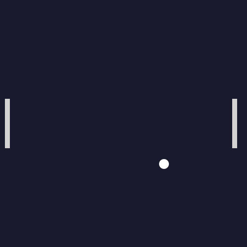

### Objectif

Implémenter un jeu de Pong complet avec deux raquettes (contrôlées à la souris), une balle, et détection des collisions.

### Ce que vous allez découvrir

- Gestion de la souris (`setOnMouseMoved`) et du clavier (`setOnKeyPressed`) pour déplacer des raquettes
- Détection de collision entre rectangles (`Bounds.intersects()`)
- Propriétés de score observables liées aux labels d'affichage
- Boucle de jeu avec `AnimationTimer`
- `Bindings.when()` pour la logique de rebond sur les raquettes

### Architecture générale


### Travail à faire

1. **Activez** les tests de `SlowPongTest`
2. Construisez l'arène : un `Pane` 800x600 avec deux `Rectangle` (raquettes) et un `Circle` (balle)
3. Liez les positions des raquettes aux événements souris (`setOnMouseMoved` sur l'arène)
4. Implémentez la boucle `AnimationTimer` avec déplacement, rebonds et détection de sortie
5. Liez les labels de score aux propriétés de score avec `bind()`
6. Ajoutez un bouton "Rejouer" qui remet les scores a zéro et replace la balle au centre

---

## Ressources complémentaires

- [CM2 - Propriétés, bindings et contrôles](https://iutinfoaix-r202.github.io/cours/cm2-donnees-et-liaison.html)
- [OpenJFX - Getting Started](https://openjfx.io/openjfx-docs/)
- [JavaFX Properties and Bindings](https://openjfx.io/javadoc/25/javafx.base/javafx/beans/package-summary.html)
- [TestFX Documentation](https://github.com/TestFX/TestFX)

---

*IUT d'Aix-Marseille - Département Informatique - 2026*
